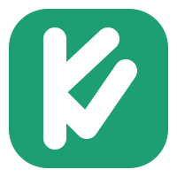

  

<h1 align="center">Klass</h1>

  A vida escolar do aluno, na mão da família, na hora em que acontece.

---

O **Klass** é uma plataforma brasileira que conecta escolas e famílias. A escola usa o Klass no dia a dia, para fazer a chamada em sala, lançar notas e publicar a agenda e os comunicados. Os responsáveis acompanham tudo em tempo real: presenças e faltas, notas, boletins, provas, eventos e observações dos professores.

### O que estamos construindo

- 📋 Gestão acadêmica: turmas, matrículas, notas e frequência por aula
- 🔔 Avisos em tempo real para os responsáveis, como o de ausência na aula
- 🏫 Ferramentas para a gestão da escola, com importação por planilha
- 📱 Apps para responsáveis, alunos, professores e gestores

### Como trabalhamos

- 🇧🇷 Produto em português, código em inglês.
- 🔒 Segurança e privacidade vêm antes de prazo: o Klass lida com dados de crianças e adolescentes (LGPD).
- ♿ Interface acessível (WCAG AA).
- 📐 Requisitos bem definidos e documentação consistente antes de cada funcionalidade entrar em desenvolvimento.
- ✅ Todo merge passa por pull request com CI verde.

O produto está em desenvolvimento ativo. Os repositórios entram nesta organização conforme forem criados.

### Links

- 🌐 [klass.com.br](https://klass.com.br)
- 🛡️ Encontrou uma falha de segurança? Veja a nossa [política de segurança](https://github.com/klass-io/.github/blob/main/SECURITY.md).
